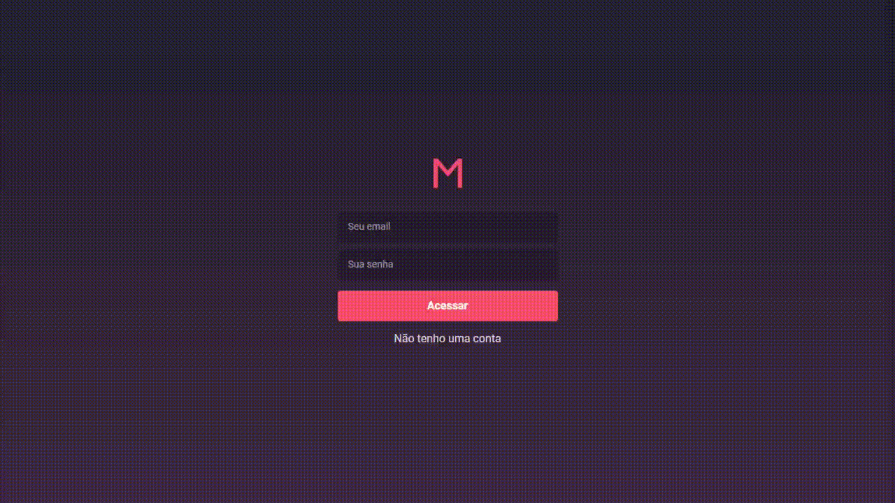
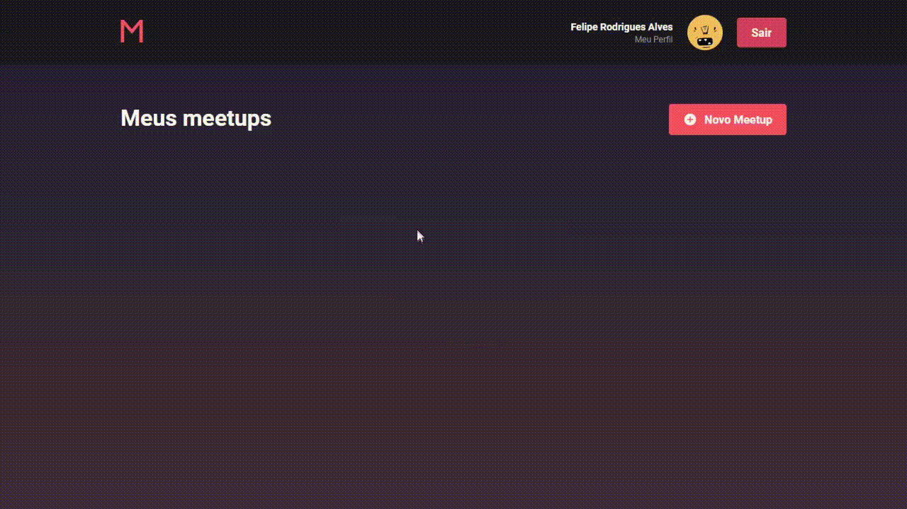

# MeetApp - Rocketseat - Bootcamp - Challenge - Specifications (portuguese)

Criação de frontend com ReactJS do Meetapp que utilizará a API desenvolvida. [(aqui)](../backend/)

Criada aplicação utilizando create-react-app e configurada com Reactotron, Redux e Redux Saga.

Essa aplicação será utilizada apenas por organizadores de meetups, não será necessário as funcionalidades de inscrições em Meetups

O layout do projeto está anexado nesse repositório. [(aqui)](./StyleGuide)

## Telas

### SignIn e SignUp

O usuário deve poder se autenticar utilizando e-mail e senha.
O usuário deve poder se cadastrar com nome, e-mail e senha.

### Profile

O usuário deve poder editar suas informações de cadastro.

### Dashboard e Meetup Create

O usuário deve poder listar os meetups que organiza e clicar para ver detalhes de um meetup.
Nessa tela o usuário pode navegar para a página de criação de meetup.

### Detalhes e Meetup Edit / Delete + SignOut

O usuário deve poder visualizar detalhes de um meetup previamente cadastrado.
Nessa tela o usuário pode editar os dados de um meetup ou até cancelar um meetup.

