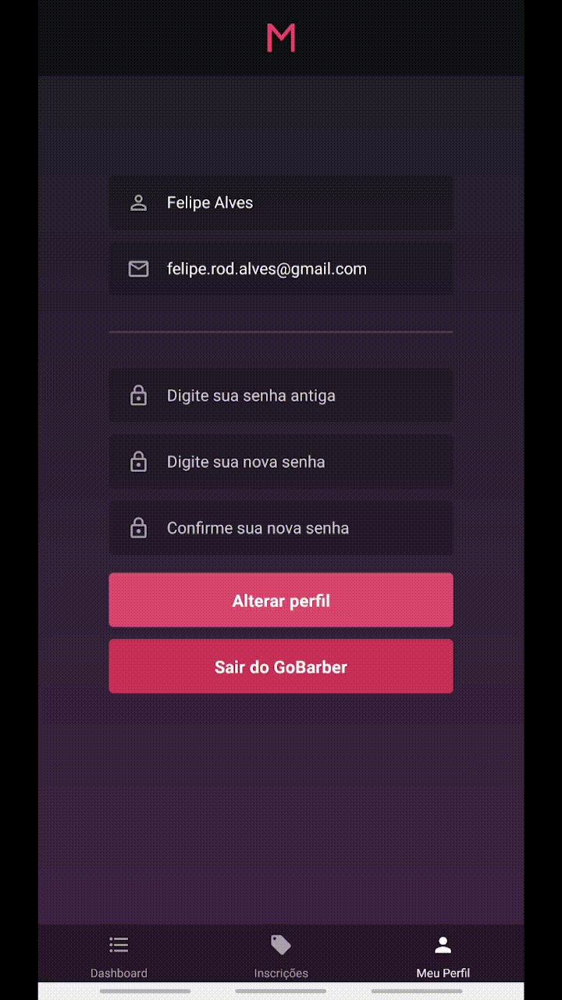
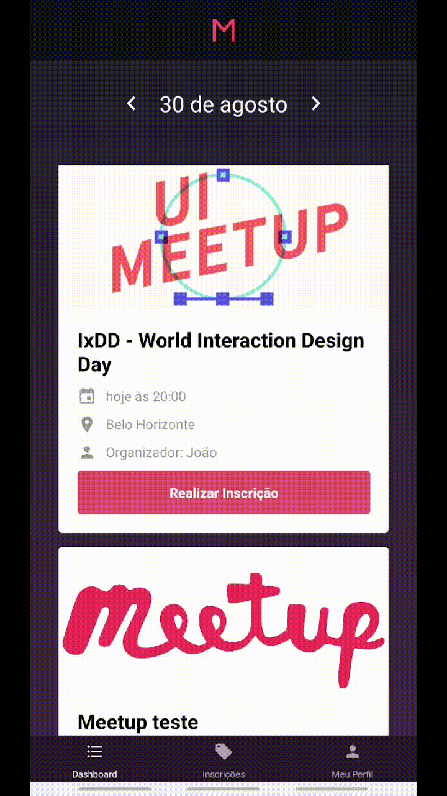

# MeetApp - Rocketseat - Bootcamp - Challenge - Specifications (portuguese)

Criação de aplicação mobile com React Native do Meetapp que utilizará a API desenvolvida. [(aqui)](../backend/)

Criada aplicação utilizando react-native init e configurada com Reactotron, Redux e Redux Saga.

Essa aplicação será utilizada por qualquer usuário, não será necessário as funcionalidades de criação de Meetups

O layout do projeto está anexado nesse repositório. [(aqui)](./StyleGuide)

## Telas

### SignIn e SignUp

O usuário deve poder se autenticar utilizando e-mail e senha.
O usuário deve poder se cadastrar com nome, e-mail e senha.

### Profile

O usuário deve poder editar suas informações de cadastro.

### Dashboard e Meetup Subscription

O usuário deve poder navegar pelos meetups por data.
O usuário deve poder visualizar suas inscrições em meetups.

